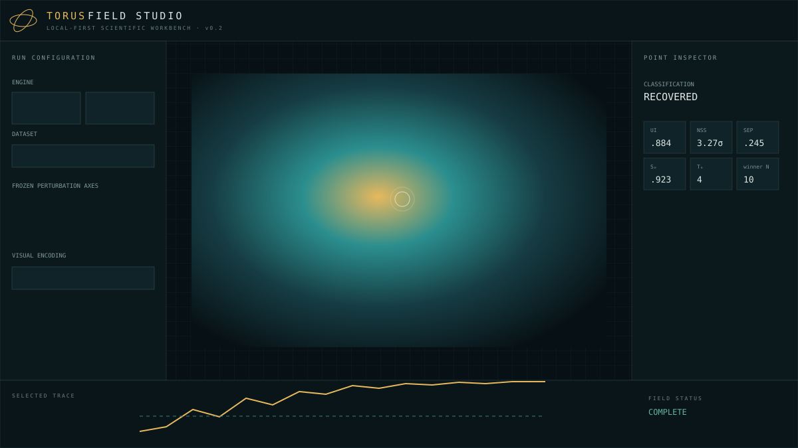

# TORUS Field Studio

> Every beautiful structure should trace back to a frozen computation.

TORUS Field Studio is a local-first scientific workbench for generating, inspecting, and
auditing geometric field artifacts. The v0.1 release deliberately separates two engines:

- **Analytic Sandbox** — reproducible `z -> z^p + c` fields with an explicit
  `ILLUSTRATIVE_ANALYTIC` claim badge.
- **TORUS-BROT** — a deterministic registered-ladder reference kernel with matched nulls,
  structural escape, recovery, ringing, `T_e`, `S_e`, `winner_N`, UI, NSS, and SEP retained
  as separate values.

The image is downstream of the artifact: classification is computed before rendering,
interpolation never creates observations, and every exported bundle includes a SHA-256
manifest, run specification, visual encoding, provenance, claim boundary, and failure ledger.

[Open the browser studio](https://genghisdarb.github.io/torus-field-studio/) or download the
[v0.1.0 canonical release artifacts](https://github.com/GenghisDarb/torus-field-studio/releases/tag/v0.1.0).
The release includes analytic and synthetic parent/null TBX bundles plus a `SHA256SUMS.txt` file.



## Quick start

Clone the repository and enter it before installing. The commands below are for Windows
PowerShell and do not require a globally installed `pnpm`:

```powershell
git clone https://github.com/GenghisDarb/torus-field-studio.git
Set-Location torus-field-studio
Set-ExecutionPolicy -Scope Process Bypass
.\scripts\setup.ps1

& .\.venv\Scripts\python.exe -m torusbrot.cli generate local `
  --spec examples/tld-parent-null/run-spec.json `
  --domain examples/tld-parent-null/domain.json `
  --output results/parent-null.tbx.zip
& .\.venv\Scripts\python.exe -m torusbrot.cli audit results/parent-null.tbx.zip

.\scripts\studio.ps1
```

If the repository is already cloned, start with `Set-Location` using its actual folder. The
bootstrap script creates `.venv`, installs the Python package and development tools, and uses
the repository-pinned pnpm version through npm, an existing pnpm, or Codex's bundled runtime.
Outside Codex, install Node.js 24 before running the browser studio. Python-only users can run
`.\scripts\setup.ps1 -SkipWeb`.

For macOS or Linux:

```bash
git clone https://github.com/GenghisDarb/torus-field-studio.git
cd torus-field-studio
python3 -m venv .venv
.venv/bin/python -m pip install -e '.[dev]'
.venv/bin/python -m torusbrot.cli generate local --spec examples/tld-parent-null/run-spec.json \
  --domain examples/tld-parent-null/domain.json --output results/parent-null.tbx.zip
.venv/bin/python -m torusbrot.cli audit results/parent-null.tbx.zip
npx --yes pnpm@11.19.0 install
npx --yes pnpm@11.19.0 run dev
```

Open the Vite URL to explore the built-in analytic and ladder examples. Click any computed
point to inspect its classification, parent/null metrics, provenance, legal interpretation,
and recovery timeline. Use **Import bundle** to open a `.tbx.zip` created by the CLI.

## Strict TBX audit

Both the CLI and browser treat archives as hostile. Before a bundle is trusted, the auditor
checks safe canonical paths, duplicate and encrypted members, expansion limits, exact manifest
membership, byte counts and SHA-256 hashes, JSON schemas, grid and point identity, finite metrics,
statistics, parent/null counts, provenance, claim authority, verification receipts, failure
references, specification hashes, run identity, and `SHA256SUMS.txt`.

```powershell
& .\.venv\Scripts\python.exe -m torusbrot.cli audit path\to\artifact.tbx.zip
```

A failed audit returns stable issue codes such as `ARCHIVE_PATH_INVALID`,
`MANIFEST_HASH_MISMATCH`, or `VERIFIER_RECEIPT_MISSING`. No field table is exposed after failure.

## CLI

```text
torusbrot init my-study
torusbrot validate domain-pack examples/tld-parent-null/domain.json
torusbrot freeze examples/tld-parent-null/run-spec.json
torusbrot generate analytic --spec examples/analytic-z14/run-spec.json -o results/z14.tbx
torusbrot generate local --spec examples/tld-parent-null/run-spec.json \
  --domain examples/tld-parent-null/domain.json -o results/parent-null.tbx
torusbrot nulls generate --domain examples/tld-parent-null/domain.json --seed 1407
torusbrot audit results/parent-null.tbx
torusbrot compare results/run-a.tbx results/run-b.tbx
torusbrot export results/parent-null.tbx --format csv --output results/field.csv
torusbrot studio
```

## Python API

```python
from torusbrot import DomainPack, LocalBrotRun, MatchedNullPolicy

domain = DomainPack.load("examples/tld-parent-null/domain.json")
run = LocalBrotRun.from_file("examples/tld-parent-null/run-spec.json")
result = run.execute(domain, MatchedNullPolicy(count=12, seed=1407))
result.audit()
result.export_tbx("results/example.tbx")
```

## Scientific contract

This repository makes a strict claim distinction:

| Level | Badge | Meaning |
| --- | --- | --- |
| 0 | `ILLUSTRATIVE_ANALYTIC` | Declared visual or analytic model only |
| 1 | `COMPUTED_DYNAMICAL` | Reproducible registered computation |
| 2 | `TLD_DERIVED` | Registered ladder plus matched-null endpoints |
| 3 | `EXTERNALLY_VALIDATED` | Independently reproduced, held-out result |

The bundled ladder example is a **synthetic reference fixture** and is marked
`COMPUTED_DYNAMICAL`. Supplying a domain pack does not automatically grant Level 2 or Level 3;
that authority must be registered in the pack and independently audited.

ToT-BROT, ToT-BULB, and Dual-Space contracts are included as forward-compatible schemas only.
They are not represented as validated engines in v0.1.

Read [the scientific contract](docs/scientific_contract.md),
[the TBX format](docs/tbx_spec.md), [schema migration policy](docs/schema_migrations.md),
[browser performance budget](docs/performance_budget.md), and [the roadmap](docs/roadmap.md)
before interpreting a result.

## Development

```bash
python -m pytest
python -m ruff check python tests scripts
python scripts/sync_schemas.py --check
pnpm run schemas:check
pnpm run typecheck
pnpm run build
pnpm run budget
python scripts/generate_hostile_fixtures.py --output tests/generated-fixtures
pnpm run e2e
```

The Python reference engine is the classification authority. Browser kernels are small-run
exploration tools and identify themselves as browser previews. No computed field, large bundle,
or `node_modules` directory is committed to Git.

See [CONTRIBUTING.md](CONTRIBUTING.md), [SECURITY.md](SECURITY.md), and
[CHANGELOG.md](CHANGELOG.md) for project policy and release history.

## License

MIT. Scientific results remain subject to the claim boundary stored with each artifact.
